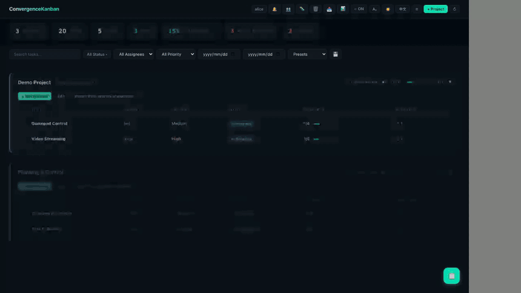
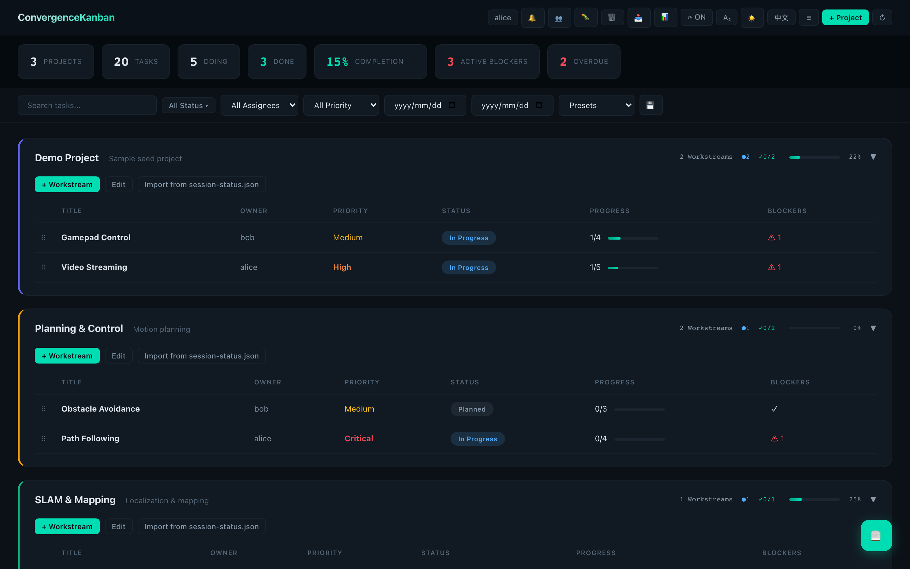
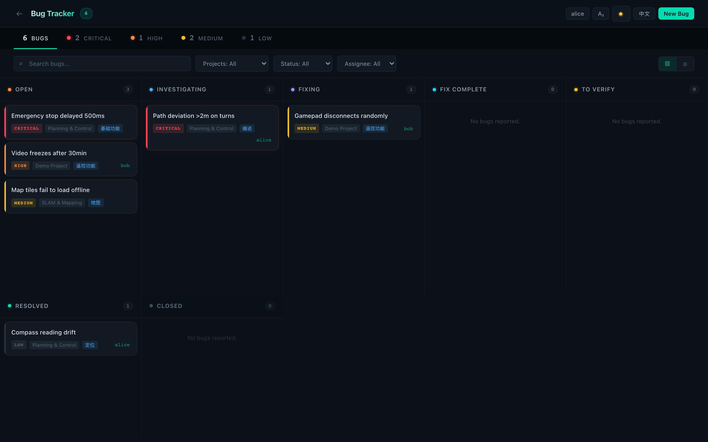
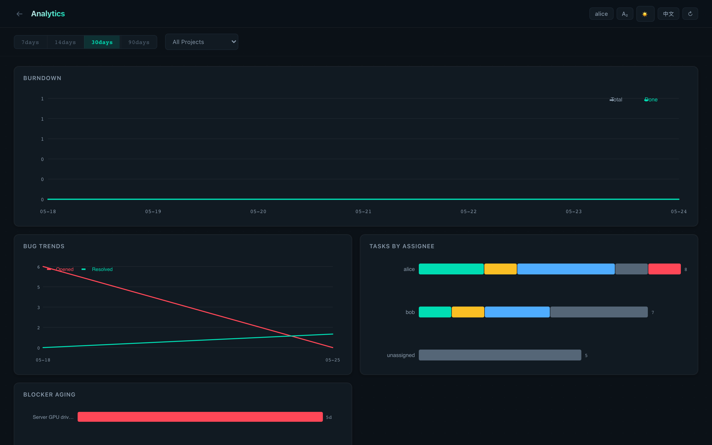

# ConvergenceKanban

> 一个面向**飞书 / Lark** 团队、并把 **AI 编码代理**当作正式贡献者的自托管看板。
> 中英双语（EN / ZH），飞书原生，代理优先。

> 🇬🇧 English version: [`README.md`](README.md)

[](LICENSE)
[](https://www.python.org/)
[](https://fastapi.tiangolo.com/)
[](https://github.com/phoenixjyb/convergence-kanban/actions)
[](https://github.com/phoenixjyb/convergence-kanban/releases)

```
项目 → 工作流 → 任务 → 子任务
缺陷（人工 + 代理两条流，7 状态流程）
可选 飞书 Bitable 同步 · 群聊机器人 · Wiki QA 工单
REST API · 代理治理 · 审计日志
```



## 为什么做这个？

如果你的团队用飞书（或 Lark），并开始让 AI 编码代理提 Bug、领任务、提
MR，你大概率会撞到我撞过的墙：飞书对人友好但对脚本不友好；像 Jira 这种
REST 优先的工具又会把人从飞书里逼出去。ConvergenceKanban 就坐在两者之间。

代理走干净的 REST API。看板服务用**自己的飞书凭证**把状态镜像到 Bitable。
人继续在飞书里看。SQLite 是唯一的真源。带冲突检测的双向同步保证 Bitable
里的手工编辑能干净地回流到数据库。

[→ 完整设计动机](docs/WHY_THIS_PROJECT.md)

## 快速开始

```bash
# 一键安装脚本（需要 Docker）
curl -fsSL https://raw.githubusercontent.com/phoenixjyb/convergence-kanban/main/install.sh | bash
```

大概 60 秒内你就能在 `http://localhost:8666` 看到一个可用的看板，**完全
不需要配置飞书**。

如果要启用飞书集成：

1. 到 https://open.feishu.cn/app （或对应的 Lark 后台）创建一个自建应用
2. 把 `FEISHU_APP_ID` / `FEISHU_APP_SECRET` 写进 `.env`
3. 执行 `docker compose --profile feishu up -d`

完整步骤（包括需要哪些权限范围）见 [→ docs/SETUP.md](docs/SETUP.md)。

### 或者从源码运行

```bash
git clone https://github.com/phoenixjyb/convergence-kanban.git
cd convergence-kanban
cp .env.example .env
python3 -m venv venv && . venv/bin/activate
pip install -r requirements.txt
python3 app.py
# → http://localhost:8666
```

### 配合 Claude Code 使用（30 秒）

在目标仓库的 `CLAUDE.md` / `AGENTS.md` 里塞一行，就能把任意 AI 代理接到
这个看板上：

```bash
echo '看板 API 契约：curl http://localhost:8666/api/agent-guide' >> CLAUDE.md
```

代理首次运行时会拉取这份在线指引，之后通过 REST 提缺陷、领任务。比如：
代理用 `POST /api/bugs` 提交一个崩溃报告——它会以 `RD-YYMMDD-NNN` 卡片
的形式落到看板上，人类 QA 团队直接可见，不需要绕飞书一圈。

## 功能

### 看板



- 项目 → 工作流 → 任务 → 子任务
- 每个任务支持优先级、负责人、开始/截止日期、依赖关系、工时记录、周期任务
- 软删除 + 恢复（按实体类型），有专门的回收站视图
- 任务批量操作（多选）
- 每个实体可挂线程化评论
- 双语字段——所有标题/描述都有 `*_en` / `*_zh` 两份；UI 上可切换语言
- 完整的操作审计日志，按 `X-Kanban-User` 归属

### 缺陷流水线



7 状态流程，分为两条独立的流：

```
open → investigating → fixing → fix_complete → to_verify → resolved → closed
                                  ↑                ↑
                         （日常 MR 级 QA）  （版本验证）
```

- `source='manual'`（QA 团队提）和 `source='agent'`（AI 代理提）被路由到不同的展示表，便于过滤
- 人可读的展示 ID：`BUG-YYMMDD-NNN` / `RD-YYMMDD-NNN`，每天按前缀重置编号
- 修复元数据字段（`fix_method`、`fix_version`、`fix_date`）在状态切到 `fix_complete`/`to_verify`/`resolved` 时填入
- 缺陷 ↔ 任务多对多关联

### 数据分析



- 燃尽图 / 燃起图
- 缺陷趋势
- 按负责人的工作负载
- 阻塞项时长统计
- 多项目甘特图，支持项目 chip 选择 + 工作流过滤

### 可选的 飞书 / Lark 集成

所有飞书功能都是**可选的**。`.env` 里把 `FEISHU_APP_ID` 留空就可以把
ConvergenceKanban 当独立看板用。可以按需启用：

| 功能 | 模块 | 作用 |
|------|------|------|
| Bitable 双向同步 | `feishu_sync.py` | 每 30 秒轮询 Bitable；推本地变更；拉远端变更；按字段做冲突检测 |
| 交互式聊天机器人 | `feishu_bot.py` | 长连接 WebSocket；双语 `@bot help`、`@bot my tasks`、`@bot bugs` 等指令 |
| 群消息通知 | `feishu_notify.py` | 在缺陷/阻塞/任务事件时往飞书群 webhook 发卡片 |
| 周报摘要 | `feishu_digest.py` | 定时按项目推送总结卡片 |
| Wiki QA 工单 | `feishu_docs.py` + `routes/qa_tickets.py` | 在可配置的父页面下创建 wiki 页面，承载 QA 测试/数据采集请求 |

### 可选的 Slack / 钉钉 通知

缺陷/阻塞/任务事件可以并行扇出到多个聊天平台——在 `.env` 中设置对应
的 webhook URL 就可以开启任意组合。

| 平台 | 模块 | 启用方式 |
|------|------|---------|
| Slack | `slack_notify.py` | Incoming Webhook URL → `SLACK_WEBHOOK_URL` |
| 钉钉 / DingTalk | `dingtalk_notify.py` | 群机器人 webhook → `DINGTALK_WEBHOOK_URL`（可选 HMAC 签名 secret） |

调度器 `notify.py` 会把每个事件分发到所有已配置的后端。其中一个失败不
影响其它。详细步骤见 [docs/SETUP.md](docs/SETUP.md) 第 4、5 节。

### AI 代理集成

- REST API 挂在 `/api/...` ——看板里能做的每个动作都有对应的 JSON 接口
- 身份通过 `X-Kanban-User: alice-claude`（`{名字}-{工具名}` 格式）声明
- 只接受**预先注册的机器人账号**；未知用户直接 HTTP 401
- 机器人治理：bot 不能把任务标 `done`/`abandoned`，不能删项目/工作流/任务/缺陷，不能改工作流优先级
- 提缺陷策略：bot 提 bug 时被静默改写为 `source='agent'`，不会污染人手工维护的缺陷表
- 在线代理指引 `GET /api/agent-guide` ——往任何项目仓库的 `CLAUDE.md` / `AGENTS.md` 里塞一行 `curl`，代理就能一直拉到最新版本
- CLI 工具 `agents/kanban_worker.py`（`my-tasks`、`pick-task`、`report-bug`、`complete-task` 等）

[→ 完整代理集成指南（英文）](docs/AGENT_INSTRUCTIONS.md)
[→ 简短参考](docs/AGENT_QUICKSTART.md)
[→ 架构（中文）](docs/AGENT_ARCHITECTURE_zh.md)

## 与其它看板对比

|                    | ConvergenceKanban | Vikunja | WeKan | Focalboard | Trello | Jira |
|--------------------|:-:|:-:|:-:|:-:|:-:|:-:|
| 中英双语（字段级）            | 是 | 仅 UI | 仅 UI | 仅 UI | 否 | 仅 UI |
| 飞书 / Lark 原生           | 是 | 否 | 否 | 否 | 否 | 否 |
| AI 代理原生（REST + 治理）    | 是 | 否 | 否 | 否 | 否 | 部分 |
| 自托管                       | 是 | 是 | 是 | 是 | 否 | 是（DC 版） |
| SQLite，单文件简单部署        | 是 | 否（Postgres/MySQL）| 否（MongoDB）| 否（Postgres）| n/a | 否 |
| 免费 / 开源                  | 是（MIT）| 是（AGPL）| 是（MIT）| 是（MPL，已停更）| 否 | 否 |

老实说说别人比我们强的地方：Vikunja 的权限和团队管理模型远比我们丰富；
WeKan 是更成熟的纯 Trello 克隆，插件生态更大；Jira 的企业生态没有任何
自托管工具能匹敌。ConvergenceKanban 的定位很窄——*飞书团队* 和 *把 AI 代理
当贡献者* 这两件事的交集。如果你不在这个交集里，上面任意一个可能更合适。

## 架构

```
浏览器 / curl / AI 代理
        │
        │ HTTP (X-Kanban-User: alice-claude)
        ▼
┌──────────────────────────────────────────┐
│ FastAPI (app.py)                         │
│  - 22 个路由模块                          │
│  - 中间件：身份 + 治理                    │
│  - SQLite（WAL 模式）                     │
└────────────┬─────────────────────────────┘
             │
             ├─→ 飞书 / Lark 开放平台
             │     - Bitable 双向同步
             │     - Wiki（QA 工单）
             │     - IM（聊天机器人 + 群通知）
             │
             └─→ notify.py 调度器（扇出）
                   ├─→ feishu_notify.py
                   ├─→ slack_notify.py
                   └─→ dingtalk_notify.py
```

## 项目结构

```
.
├── app.py                  入口
├── db.py                   SQLite 初始化 + migration
├── models.py               Pydantic 数据模型
├── helpers.py              共享工具（时区、bot 治理、展示 ID）
├── routes/                 功能模块（tasks、bugs、qa_tickets 等）
├── notify.py               聊天平台调度器（扇出）
├── feishu_*.py             可选的飞书集成
├── slack_notify.py         可选的 Slack Incoming Webhook 通知
├── dingtalk_notify.py      可选的钉钉群机器人通知
├── agents/                 AI 代理用的 CLI 工具（kanban_worker.py）
├── static/                 纯 HTML/JS/CSS 前端
├── docs/                   安装、代理指南、架构文档
├── tests/                  239 个 pytest 测试
├── scripts/                备份、完整性检查、开发种子数据
├── Dockerfile              单阶段生产镜像
├── docker-compose.yml      看板 + 可选的同步 / 机器人（按 profile 启动）
├── install.sh              一键安装脚本
└── .env.example            带注释的配置模板
```

## 测试

```bash
pip install -r requirements-dev.txt
pytest tests/ -x -q
```

共 239 个测试。干净环境下应在 5 秒内跑完。

## 贡献

欢迎 PR。详见 [CONTRIBUTING.md](CONTRIBUTING.md)，行为准则见
[CODE_OF_CONDUCT.md](CODE_OF_CONDUCT.md)。
发布历史见 [CHANGELOG.md](CHANGELOG.md)。

## 许可

[MIT](LICENSE)
